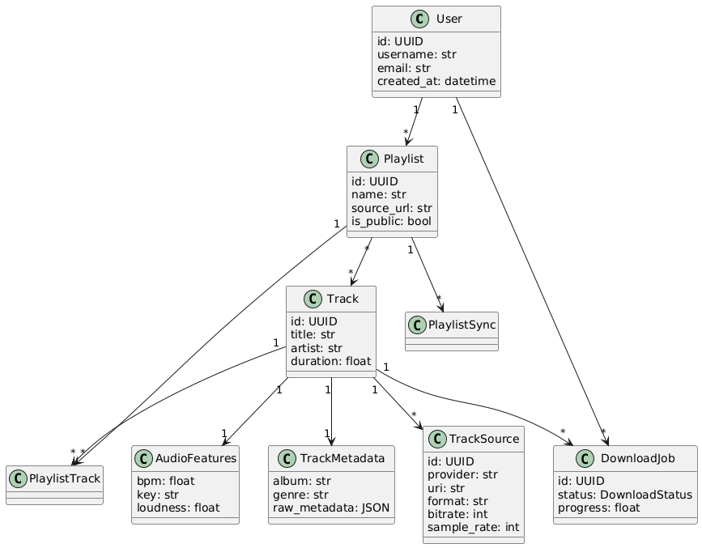

# AIX

Aplicación simple de gestión de playlists, exportación entre plataformas, descarga, análisis de tracks individuales, búsqueda...

### Motivación
Crear un CRUD con FastAPI, SQLAlchemy, MySQL, Docker y demás para aprender más sobre el desarrollo con estas herramientas.

### Propuesta
Las funcionalidades principales de la aplicación son las siguientes:
- Gestión de **usuarios** (conexión con plataformas).
- CRUD de **playlists** y **tracks**.
- Almacenamiento de datos locales y remotos (**tracks**, **metadatos**, **información de audio**).
- Endpoints para **exportar/importar** playlists.
- Endpoints para **parsear** y **descargar** playlists.
- Análisis y gestión de **playlists** de manera remota en varias plataformas.
- Registro y descarga de **playlists**.
- Indexación de **tracks**.
- Dockerización completa del stack (app + bd).
- Módulo frontend sencillo.

### Entidades principales
| Clase     | Descripción |
|-------------|-------------|
| `User`      | Representa un usuario del sistema. |
| `Playlist`  | Conjunto de tracks (locales/remotos). |
| `Track`     | Pista musical básica. |
| `TrackInfo` | Metadatos ampliados de una pista (ej. duración, artista, etc.). |

## Diagrama de clases


### Dependencias
Este proyecto usa **Poetry** para la gestión de dependencias y entornos virtuales.

## Requisitos
- Python 3.10+
- Poetry

## Instalación de dependencias
```bash
poetry install
poetry shell
```

## Ejecutar la aplicación
```bash
poetry run uvicorn app.main:app --reload
```

## Clonar repositorio
```bash
git clone https://github.com/nmg20/aix.git
cd aix
```

## Variables de entorno
```bash
nano .env.example
# Editar datos del entorno
cp .env.example .env
```

## Docker
Iniciar los servicios:
```bash
# Esto levantará la bd (en el futuro también el backend completo)
docker compose up -d

# Comprobar que está corriendo
docker ps

# Ver logs por si falla algo
docker compose logs -f
```